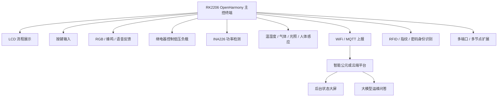
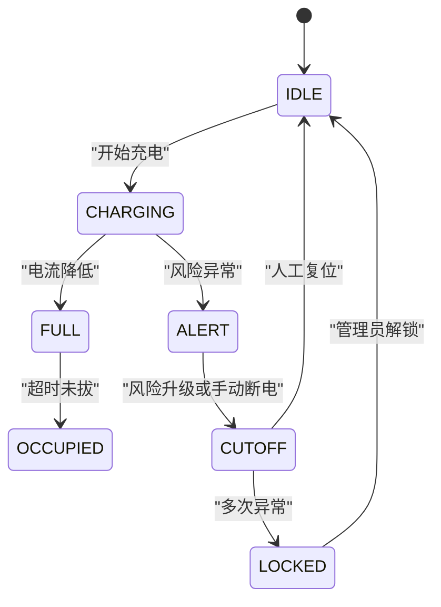

# OpenHarmony 社区电动车安全充电项目整体开发介绍

## 一、项目概述

本项目面向社区电动车集中充电场景，基于 RK2206 OpenHarmony 综合开发板，设计并实现一套“安全充电终端 + 多传感器检测 + 远程监管平台 + 大模型运维问答”的可扩展原型系统。

项目的核心不是单独展示某一个传感器，而是围绕社区充电中常见的安全问题和管理问题，构建一条完整闭环：

```text
用户开始充电 -> 设备实时检测 -> 风险识别 -> 声光提醒 -> 断电保护 -> 事件上报 -> 后台监管 -> AI 问答分析
```

系统初期只做低压安全演示，不接入 220V 市电。通过 5V/12V 小负载、继电器、电流功率检测模块和板载传感器，模拟真实社区充电桩的安全监测与保护流程。后期可继续扩展为多充电口、多节点联网、用户身份识别、预约计费、故障追溯和后台大屏系统。

## 二、项目背景

社区电动车充电存在以下典型问题：

| 问题 | 具体表现 | 本项目解决思路 |
|---|---|---|
| 充电安全风险 | 过温、超流、短路、烟雾、异常功率 | 多传感器检测 + 风险评分 + 自动断电 |
| 充电位占用 | 充满后不及时拔车 | 充满提醒 + 占位提醒 + 事件记录 |
| 监管不及时 | 管理人员不能实时知道异常 | WiFi/MQTT 上报 + 后台告警 |
| 故障难追溯 | 事故发生后缺少记录 | 事件日志 + 故障码 + 历史数据 |
| 用户体验弱 | 缺少本地提示和远程说明 | LCD、RGB、蜂鸣、语音播报、大模型问答 |

因此，本项目定位为“面向社区安全充电的智能便民设施”，既能体现嵌入式开发能力，也能体现 OpenHarmony 联网、传感器融合、云端监管和 AI 应用结合的综合能力。

## 三、项目总体目标

项目按照“初期演示可用，后期平台可扩展”的思路设计。

第一阶段目标是完成板端低压安全充电演示闭环，让评委能够直接看到完整流程：

```text
待机安全 -> 正在充电 -> 风险告警 -> 断电保护 -> 人工复位
```

中期目标是接入真实硬件：

- INA226 电压电流功率检测模块
- 4 路 5VDC 光耦隔离继电器模块
- 低压小灯、小风扇、小电机等负载
- 蜂鸣器或语音模块
- RFID、指纹、密码等身份识别模块

后期目标是形成平台化作品：

- 多充电口独立控制
- 多节点联网采集
- 云端后台监管
- 大模型运维问答
- 自动生成安全巡检报告
- 数据分析与维护建议

## 四、当前项目状态

目前项目已经具备较好的 V1 原型基础。

### 4.1 开发环境

| 项目 | 当前状态 |
|---|---|
| Docker OpenHarmony 编译环境 | 已跑通 |
| 源码工程 | 已拉取并可编译 |
| RKDevTool 烧录 | 已跑通 |
| MobaXterm 串口查看 | 已跑通 |
| WiFi 热点 | 已连接 `example-2.4g-wifi / example-password` |
| 主开发目录 | `path/to/txsmartropenharmony/vendor/isoftstone/rk2206/samples/e1_iot_smart_home_hwiot` |

### 4.2 板端功能

| 功能 | 当前状态 |
|---|---|
| LCD 显示 | 已显示“社区安全充电”界面 |
| 按键控制 | 已实现上、下、左、右四键流程 |
| 状态机 | 已实现待机、充电、告警、断电、复位 |
| RGB 状态灯 | 已用于状态提示 |
| 板载电机 | 可作为充电动态展示 |
| 温湿度数据 | 已接入显示 |
| 烟雾/气体数据 | 当前可作为模拟告警入口 |
| WiFi/MQTT | 已具备联网基础 |
| 电流功率 | 当前仍为模拟数据 |
| 继电器 | 当前为软件状态，待接真实模块 |

### 4.3 当前按键定义

| 按键 | 当前作用 | 展示意义 |
|---|---|---|
| 上键 | 开始充电 | 进入正在充电流程 |
| 左键 | 模拟告警 | 触发风险告警 |
| 右键 | 断电保护 | 模拟保护断电 |
| 下键 | 人工复位 | 清除告警，回到待机 |

当前这套按键逻辑适合比赛演示，可以让评委在短时间内看懂系统的安全闭环。

## 五、硬件资源分工

### 5.1 RK2206 综合板

RK2206 综合板作为主控终端，承担本项目的核心功能：

- LCD 本地显示
- 按键输入
- WiFi/MQTT 联网
- RGB 状态灯
- 板载电机动态展示
- 温湿度、气体、光照、人体感应等传感器输入
- SU-03T 语音模块控制
- 继电器与功率检测模块控制

它是整个项目的主控、显示和联网核心。

### 5.2 INA226 电压电流功率模块

INA226 用于替换当前模拟电流功率数据，实现真实检测：

- 读取电压
- 读取电流
- 计算功率
- 估算电量
- 判断超流
- 判断充满状态
- 为风险评分提供依据

建议使用 `INA226 / CJMCU-226`，优先选择带接线端子的版本，便于接入低压负载。

### 5.3 4 路 5VDC 光耦隔离继电器模块

继电器模块用于实现真实断电保护。

推荐选择：

```text
4 路 5VDC 光耦隔离继电器模块
支持高/低电平触发，或低电平触发版本
```

选择 4 路的原因：

- 第一阶段可以只用 1 路做单充电口演示
- 后期可以扩展到 4 个充电口
- 比 1 路模块更适合展示“社区多充电位”的平台化方向

### 5.4 蜂鸣器模块

蜂鸣器作为语音播报的兜底告警手段：

- 风险告警时短响
- 断电保护时长响
- 故障锁定时连续提示

即使语音模块调试不稳定，蜂鸣器也能保证现场演示有明显反馈。

### 5.5 SU-03T 语音模块

语音模块用于增强比赛展示效果。

建议播报内容：

| 事件 | 播报内容 |
|---|---|
| 待机 | 待机安全 |
| 开始充电 | 开始充电 |
| 风险告警 | 风险告警，请注意安全 |
| 断电保护 | 已断电保护 |
| 人工复位 | 人工复位成功 |
| 充满提醒 | 充满提醒，请及时拔车 |
| 故障锁定 | 故障锁定，请联系管理员 |

固件侧只负责发送事件码，语音模块侧需要使用配套工具绑定对应播报词。

### 5.6 RFID、指纹、密码门锁板

这块板适合后期作为用户身份识别模块。

可设计为：

- 普通用户刷卡或输入密码后开始充电
- 指纹识别绑定用户身份
- 管理员身份才能解除故障锁定
- 每次充电生成用户 ID 和会话 ID

这会让项目从“安全检测设备”升级为“社区便民充电设施”。

### 5.7 MPU6050 姿态传感器

MPU6050 可以用于设备防破坏检测：

- 检测设备倾斜
- 检测撞击
- 检测异常震动
- 触发维护告警或故障锁定

这是一个适合比赛展示的创新点，因为它体现了设备运维安全。

### 5.8 LZ3863 / 星闪小板

这些小板可以作为后期多节点扩展使用。

初期不建议马上接入，避免主线开发分散。后期可以设计为：

- 每个子节点负责一个充电口
- 主控 RK2206 汇总数据
- 云端显示多个端口状态

### 5.9 OLED 小屏

OLED 小屏适合后期作为单个充电口的局部显示：

- 显示端口号
- 显示当前状态
- 显示功率
- 显示告警标志

可以用于 V3 多端口展示。

## 六、系统总体架构



## 七、板端软件架构

板端软件按 6 层设计，方便后期扩展。

### 7.1 硬件驱动层

负责直接操作硬件：

- LCD
- 按键
- RGB
- 电机
- 蜂鸣器
- SU-03T 语音模块
- INA226
- 继电器
- 温湿度
- 气体
- 光照
- 人体感应
- WiFi

### 7.2 设备抽象层

把不同硬件封装成统一接口：

```c
power_sensor_read();
relay_set_state();
motor_set_state();
alarm_set_state();
voice_play_event();
rgb_apply_state();
display_update();
network_publish();
```

### 7.3 数据模型层

统一保存设备状态：

```c
device_id
port_id
user_id
session_id
charge_state
risk_level
risk_score
voltage
current
power
energy_wh
temperature
humidity
smoke_level
relay_state
motor_state
alarm_state
network_state
fault_code
event_count
```

### 7.4 安全策略层

集中判断风险：

- 过温
- 超流
- 烟雾异常
- 充满未拔
- 占位超时
- 设备震动
- 网络离线
- 继电器异常

### 7.5 业务流程层

管理充电状态机：



### 7.6 通信展示层

负责：

- LCD 展示
- 串口日志
- MQTT 上报
- 云端命令接收
- 大模型数据接口

## 八、核心业务流程

### 8.1 正常充电流程

```text
待机安全
  -> 用户按上键或身份授权
  -> 继电器闭合
  -> 电机转动
  -> INA226 采集电压电流功率
  -> LCD 显示正在充电
  -> MQTT 上报充电状态
```

### 8.2 风险告警流程

```text
充电中
  -> 检测到过温、超流、烟雾或手动模拟告警
  -> 风险等级升高
  -> LCD 显示风险告警
  -> RGB 变为橙色或红色闪烁
  -> 蜂鸣器短响
  -> 语音播报风险告警
  -> MQTT 上报告警事件
```

### 8.3 断电保护流程

```text
风险告警
  -> 风险继续升级或按右键断电
  -> 继电器断开
  -> 低压负载停止
  -> 电机停止
  -> LCD 显示断电保护
  -> RGB 红灯常亮
  -> 蜂鸣器长响
  -> 语音播报已断电保护
  -> MQTT 上报断电事件
```

### 8.4 人工复位流程

```text
断电保护
  -> 用户或管理员按下键复位
  -> 清除告警状态
  -> 继电器保持断开
  -> 回到待机安全
  -> 语音播报人工复位成功
  -> MQTT 上报复位事件
```

## 九、LCD 展示设计

LCD 的核心目标是让评委一眼看懂当前系统状态，而不是堆满调试字段。

推荐布局：

```text
社区安全充电                       状态牌

第1步 待机安全                    Risk: 0

待机 -> 充电 -> 告警 -> 断电 -> 复位

温度: 29.3C        电流: 0.00A
烟雾: 正常         电机: 停
继电器: OFF        声光: 关
联网: 在线         事件: 12

上:开始 下:复位 左:告警 右:断电
```

不同状态的显示效果：

| 状态 | 主显示 | RGB | 电机 | 蜂鸣 | 语音 |
|---|---|---|---|---|---|
| IDLE | 待机安全 | 绿 | 停 | 关 | 待机安全 |
| CHARGING | 正在充电 | 蓝 | 转 | 关 | 开始充电 |
| ALERT | 风险告警 | 橙/红闪 | 转 | 短响 | 风险告警 |
| CUTOFF | 断电保护 | 红常亮 | 停 | 长响 | 已断电保护 |
| FULL | 充满提醒 | 蓝绿 | 停 | 短响 | 充满提醒 |
| OCCUPIED | 占位提醒 | 紫 | 停 | 短响 | 请及时拔车 |
| LOCKED | 故障锁定 | 红快闪 | 停 | 连续 | 请联系管理员 |

## 十、云端与大模型设计

### 10.1 平台产品选择

在智能公元平台创建产品时，建议选择：

```text
产品类别：其他产品
场景/模组：Wi-Fi
```

不建议选择纯离线，也不建议把“大模型”直接作为设备类型。

原因是：

- RK2206 负责采集和控制
- WiFi/MQTT 负责数据上报
- 大模型应部署在云端、PC 或后台服务中

### 10.2 MQTT 上报数据

示例：

```json
{
  "device_id": "rk2206_charge_01",
  "port_id": "port_1",
  "charge_state": "CHARGING",
  "risk_level": "L0_OK",
  "risk_score": 18,
  "voltage": 5.0,
  "current": 0.52,
  "power": 2.6,
  "energy_wh": 0.03,
  "temperature": 29.3,
  "humidity": 52.6,
  "smoke_level": 0,
  "relay_state": "ON",
  "motor_state": "ON",
  "alarm_state": "OFF",
  "network_state": "ONLINE",
  "event_count": 12
}
```

### 10.3 远程控制命令

后期支持：

```text
start_charge
stop_charge
reset_alarm
relay_off
simulate_alert
clear_alert
set_thresholds
lock_device
unlock_device
query_status
```

### 10.4 大模型运维问答

大模型不运行在 RK2206 本地，而是运行在云端或电脑端后台。

它可以读取：

- MQTT 实时状态
- 历史事件
- 风险评分
- 故障码
- 传感器曲线
- 设备在线状态
- 用户充电记录

用户可以提问：

- 为什么刚才断电了？
- 当前充电口安全吗？
- 今天发生了几次告警？
- 哪个充电口最需要维护？
- 最近异常是不是集中在某个时间段？
- 请生成今天的安全巡检报告。

大模型输出：

- 故障原因解释
- 安全建议
- 维护优先级
- 巡检报告
- 答辩展示说明
- 异常趋势总结

## 十一、分阶段开发计划

### V1：比赛演示基础版

目标：不用外接复杂硬件，也能完整展示安全充电流程。

内容：

- LCD 界面稳定显示
- 纯汉字标题“社区安全充电”
- 按键控制完整流程
- RGB 状态灯
- 电机充电时转动
- 风险告警和断电保护显示明显
- 串口输出事件日志
- MQTT 上报基础状态

验收标准：

- 上键进入充电
- 左键进入告警
- 右键进入断电
- 下键恢复待机
- 评委不看串口也能看懂流程

### V1.5：真实低压断电版

目标：让断电保护从屏幕状态变成真实物理动作。

内容：

- 接入 4 路 5VDC 继电器模块
- 接入低压小灯、小风扇或小电机
- 断电保护时继电器真实断开
- 复位后才允许重新开始

验收标准：

- 低压负载能真实通断
- CUTOFF 状态不能自动恢复
- 断电效果现场明显

### V2：真实功率检测版

目标：用 INA226 替换模拟电流功率数据。

内容：

- I2C 驱动 INA226
- 显示真实电压、电流、功率
- 计算能耗 Wh
- 根据电流判断超流
- 根据低电流持续时间判断充满
- 风险评分从模拟变为真实数据驱动

验收标准：

- 充电时电流变化可见
- 超流触发告警
- 异常触发断电保护

### V2.5：身份识别与语音版

目标：增强便民属性和现场展示效果。

内容：

- SU-03T 语音播报
- 蜂鸣器告警兜底
- RFID、指纹或密码授权充电
- 用户 ID 与充电会话绑定
- 管理员身份解除故障锁定

验收标准：

- 未授权不能开始充电
- 授权后可以启动
- 状态变化有语音或蜂鸣反馈

### V3：多端口多节点版

目标：从单板演示扩展为社区多充电位原型。

内容：

- 4 路继电器对应 4 个充电口
- 每个端口独立状态
- 每个端口独立事件记录
- OLED 或子节点显示局部状态
- LZ3863/星闪小板作为子节点探索

验收标准：

- 一个端口告警不影响其他端口
- 后台能看到多个端口状态

### V4：云平台与大模型版

目标：形成完整作品亮点。

内容：

- 后台设备列表
- 实时告警
- 历史事件
- 充电记录
- 用电趋势
- 大模型问答
- 自动生成巡检报告

验收标准：

- 能通过自然语言查询设备状态
- 能解释断电原因
- 能生成安全报告

## 十二、近期第一阶段工作重点

当前还不需要连接其他开发板，第一阶段只围绕 RK2206 综合板继续完善。

优先顺序如下：

1. 稳定当前 LCD 展示界面。
2. 保留现有状态牌和充电图片，不再随意改变视觉风格。
3. 只优化文字、流程说明和状态提示。
4. 修正电机逻辑，让充电时电机转，断电时电机停。
5. 接入或验证蜂鸣器告警。
6. 梳理 SU-03T 语音模块事件码。
7. 等 INA226 和 4 路 5V 继电器到货后，再做真实硬件闭环。

现阶段不要急着把所有开发板都连起来。先把主控板端流程做稳定，后面再逐个加模块。

## 十三、推荐购买与使用决策

### 必买优先级

| 优先级 | 模块 | 建议 |
|---|---|---|
| 1 | INA226/CJMCU-226 | 买带蓝色接线端子的版本 |
| 2 | 4 路 5VDC 光耦隔离继电器 | 买 5V 线圈版本，支持高/低电平触发更好 |
| 3 | 低压负载 | 小灯、小风扇、小电机、电阻负载 |
| 4 | 杜邦线和端子线 | 方便快速接线 |
| 5 | 独立 5V 电源 | 给继电器和负载供电 |
| 6 | 蜂鸣器模块 | 告警兜底 |

### 暂不优先

| 模块 | 原因 |
|---|---|
| ST-Link | 只有加入 STM32 子节点时才需要 |
| 12V/24V 继电器线圈版本 | 当前 RK2206 控制更适合 5V 模块 |
| 直接 220V 控制实验 | 安全风险高，不适合当前阶段 |

## 十四、安全约束

必须严格遵守：

- 只做低压演示。
- 不接 220V 市电。
- 继电器只控制 5V/12V 小负载。
- INA226 只测低压回路。
- 外部供电和 RK2206 共地前必须确认电压。
- 断电保护状态下不能自动恢复，必须人工或管理员复位。

## 十五、比赛展示脚本

建议现场按以下顺序展示：

1. 展示待机状态：LCD 显示“待机安全”，RGB 绿灯。
2. 按上键开始充电：LCD 显示“正在充电”，电机转动，RGB 蓝灯。
3. 展示实时数据：温度、电流、烟雾、继电器状态变化。
4. 按左键模拟风险：LCD 显示“风险告警”，蜂鸣器响，灯闪。
5. 按右键断电保护：继电器断开，负载停止，电机停止，红灯常亮。
6. 展示云端状态：后台看到告警和断电事件。
7. 向大模型提问：“为什么刚才断电？”
8. 大模型回答：因为检测到风险告警，系统进入断电保护。
9. 按下键人工复位：系统回到待机安全。
10. 总结亮点：多传感器融合、安全闭环、远程监管、AI 运维。

## 十六、项目亮点

本项目的比赛亮点包括：

1. **OpenHarmony 板端真实运行**
   不是纯 PPT 或纯仿真，功能已经烧录到 RK2206 开发板运行。

2. **完整安全闭环**
   覆盖待机、充电、告警、断电、复位全过程。

3. **多传感器融合**
   温湿度、气体、电流功率、人体感应、光照、姿态传感器都可纳入安全判断。

4. **真实断电保护可扩展**
   后续接入继电器后，可真实控制低压负载通断。

5. **便民属性明显**
   后续支持用户身份识别、充满提醒、占位提醒和远程管理。

6. **云端监管能力**
   通过 WiFi/MQTT 上报状态，实现远程查看和远程控制。

7. **大模型运维问答**
   后期可通过自然语言解释故障、生成巡检报告，提升作品创新性。

## 十七、总结

本项目当前已经从环境配置阶段进入板端原型阶段，RK2206 综合板已经可以展示“社区安全充电”的基础流程。下一步不需要马上接入其他开发板，而是先把主控板上的界面、按键、电机、RGB、蜂鸣、语音和 MQTT 流程打磨稳定。

等 INA226 和 4 路 5VDC 继电器模块到货后，再进入真实低压硬件闭环阶段。最终项目将从一个板端安全充电演示，逐步扩展为具备多端口管理、用户身份识别、远程监管和大模型运维问答能力的社区级智能充电设施原型。
