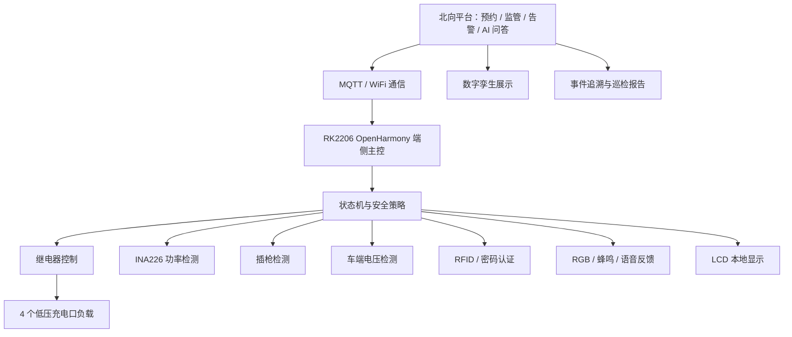
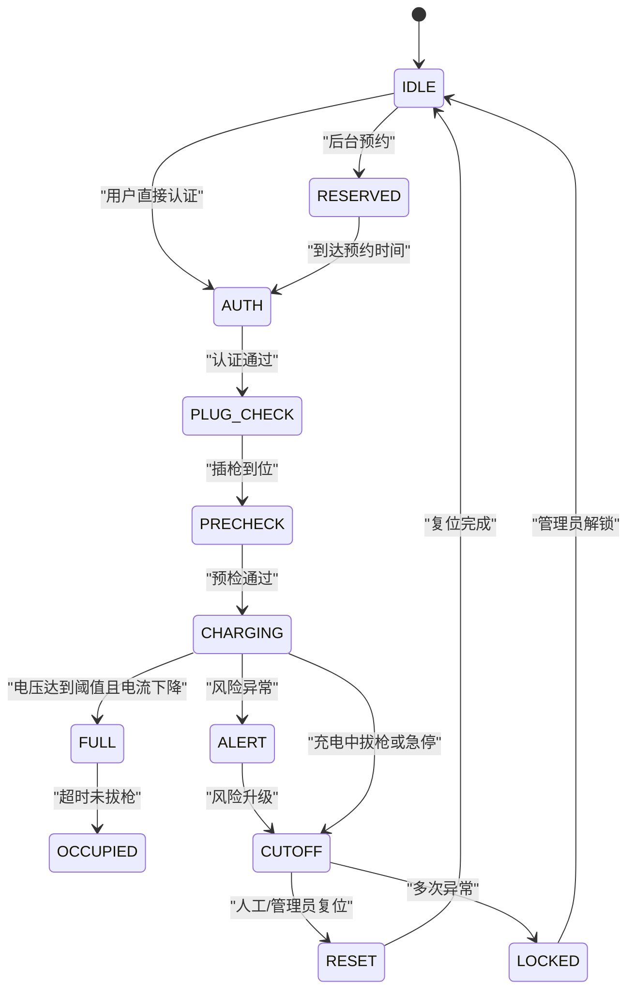

# OpenHarmony 社区电动车安全充电终端完整开发计划

版本：V2.0
定位：嵌入式开发大赛参赛方案
主线：OpenHarmony 南向硬件开发 + 社区充电完整业务闭环

## 1. 项目总定位

本项目面向社区电动车集中充电场景，基于 RK2206 OpenHarmony 开发板，设计并实现一套具备预约充电、身份认证、插枪检测、桩端电压检测、车端电池电压检测、功率监测、充满判断、占位提醒、异常断电、事件追溯、北向监管和 AI 运维问答能力的智能安全充电终端。

项目不是单纯做“温度异常断电”或“烟雾报警断电”，而是围绕真实社区充电业务，构建从南向硬件感知到北向平台监管的完整闭环。

一句话定位：

```text
基于 OpenHarmony 的社区电动车安全充电南向控制终端与北向监管系统。
```

项目核心表达：

```text
RK2206 是端侧安全充电终端的大脑。
南向硬件负责真实检测、真实控制、真实保护。
北向平台负责预约、监管、追溯和运维解释。
```

## 2. 嵌入式大赛导向

本项目参加的是嵌入式开发类比赛，因此作品重点必须放在南向硬件开发能力上。

评分表达应突出：

1. 多外设接入能力。
2. OpenHarmony 端侧开发能力。
3. GPIO、I2C、UART、WiFi/MQTT 等接口综合使用能力。
4. 继电器真实断电控制能力。
5. 传感器数据参与安全策略判断能力。
6. 端侧状态机和故障码设计能力。
7. 北向平台对端侧数据的完整承接能力。

不能让作品看起来像“网页大屏项目”或“3D 展示项目”。北向平台、数字孪生、AI 问答都应该服务于端侧硬件数据和安全闭环。

## 3. 总体闭环流程

完整业务流程如下：

```text
用户预约
-> 到达充电口
-> 身份认证
-> 插枪检测
-> 桩端输出电压检测
-> 车端/电池电压检测
-> 充电前安全预检
-> 继电器闭合
-> INA226 实时检测电压、电流、功率
-> 充电过程风险评分
-> 充满判断
-> 自动停止输出
-> 拔枪提醒
-> 占位超时告警
-> 事件上报
-> 后台监管
-> AI 解释和巡检报告
```

与普通社区充电作品相比，本项目的差异在于：

| 普通作品 | 本项目 |
|---|---|
| 只做温度、烟雾异常断电 | 做预约、认证、插枪、预检、充电、充满、占位、追溯完整闭环 |
| 只展示一个充电口 | 展示 4 个社区充电口场景 |
| 只模拟电流数据 | 使用 INA226 读取真实低压电流、电压、功率 |
| 只靠按钮切状态 | 由插枪、认证、电压、电流、继电器共同驱动状态机 |
| 只知道发生告警 | 能记录故障码和事件快照，解释为什么断电 |
| 北向只是显示页面 | 北向预约和命令会下沉到板端执行规则 |

## 4. 系统总体架构



系统分为四层：

### 4.1 南向硬件层

负责真实感知和真实控制：

- RK2206 OpenHarmony 开发板。
- 4 路继电器。
- INA226 电流、电压、功率检测模块。
- 插枪检测开关。
- 车端电压模拟采样模块。
- 低压负载。
- RGB 状态灯。
- 蜂鸣器。
- 语音模块。
- RFID 或密码键盘。
- 急停开关。
- 保险丝或自恢复保险丝。

### 4.2 OpenHarmony 端侧控制层

负责板端业务逻辑：

- GPIO 控制继电器、RGB、蜂鸣器。
- I2C 读取 INA226 数据。
- UART 连接语音模块或 RFID 模块。
- LCD 显示状态。
- 按键控制调试流程。
- WiFi/MQTT 上报数据。
- 状态机管理充电流程。
- 风险评分和故障码生成。
- 远程命令安全校验。

### 4.3 通信协议层

负责端云通信：

- WiFi 连接网络。
- MQTT 周期性上报设备状态。
- MQTT 上报告警事件。
- MQTT 接收预约任务。
- MQTT 接收远程控制命令。
- JSON 作为统一数据格式。

### 4.4 北向应用层

负责完整展示和业务管理：

- 设备总览。
- 4 口实时状态。
- 预约充电管理。
- 告警记录。
- 充电记录。
- 故障码解释。
- 数字孪生状态展示。
- AI 运维问答。
- 安全巡检报告。

## 5. 硬件总体策略

比赛版建议采用：

```text
4 个充电口外观
+ 1 个完整硬件精测口
+ 3 个业务扩展展示口
```

这样设计的原因：

1. 4 个充电口体现社区多车位应用场景。
2. 1 号口做深，体现真正的南向硬件开发能力。
3. 2、3、4 号口做业务差异化，展示预约、异常、占位等场景。
4. 降低硬件调试复杂度，避免 4 个口全部满配导致进度失控。

## 6. 硬件清单

### 6.1 必备硬件

| 硬件 | 数量 | 用途 | 优先级 |
|---|---:|---|---|
| RK2206 OpenHarmony 开发板 | 1 | 主控、LCD、按键、WiFi/MQTT、状态机 | 必备 |
| 4 路 5V 光耦隔离继电器模块 | 1 | 控制 4 个充电口低压负载通断 | 必备 |
| INA226/CJMCU-226 功率检测模块 | 1-4 | 检测电压、电流、功率 | 必备，至少 1 个 |
| 低压负载 | 4 | 小灯、小风扇、小电机，模拟车辆充电 | 必备 |
| 插枪检测开关 | 4 | 检测每个充电口是否插枪到位 | 必备 |
| RGB 状态灯或灯带 | 4 组 | 显示端口状态 | 必备 |
| 独立 5V 电源 | 1 | 给继电器、灯、低压负载供电 | 必备 |
| 端子排、接线柱、杜邦线 | 若干 | 规范接线，方便展示 | 必备 |
| 急停开关 | 1 | 一键切断所有低压负载 | 强烈建议 |
| 保险丝或自恢复保险丝 | 4 | 每个充电口独立保护 | 强烈建议 |

### 6.2 推荐增强硬件

| 硬件 | 数量 | 用途 |
|---|---:|---|
| RFID 模块或密码键盘 | 1 | 用户身份认证、管理员复位 |
| SU-03T 语音模块 | 1 | 状态播报、告警提示 |
| 蜂鸣器模块 | 1 | 告警兜底 |
| ADS1115 I2C ADC | 1 | 如果 RK2206 ADC 不够，用于车端电压采样 |
| TCA9548A I2C 多路复用器 | 1 | 多个 INA226 地址冲突时使用 |
| OLED 小屏 | 1-4 | 每个充电口局部显示状态 |
| MPU6050 姿态传感器 | 1 | 防拆、防撞、设备倾斜检测 |
| 亚克力或 3D 打印外壳 | 1 套 | 提升作品完整度和观感 |
| 低压 DC 插头或自制充电枪 | 4 | 模拟充电枪插拔 |

### 6.3 暂不建议硬件

| 硬件 | 不建议原因 |
|---|---|
| 220V 市电负载 | 安全风险高，不适合当前比赛调试 |
| 真实电动车电池 | 风险高，调试不确定性强 |
| 复杂 BMS 板 | 会拉长周期，影响主线 |
| 大量子节点开发板 | 初期会分散南向主控开发精力 |
| 12V/24V 继电器线圈版本 | 当前 RK2206 更适合控制 5V 继电器模块 |

## 7. 四个充电口功能分工

### 7.1 1 号口：完整硬件精测口

1 号口是作品最核心的南向硬件展示口。

功能：

```text
插枪检测
桩端电压检测
车端电池电压检测
INA226 电流/功率检测
继电器真实通断
充满判断
异常断电
事件上报
```

展示重点：

- 插枪不到位不能启动。
- 车端电压异常不能启动。
- 桩端输出异常不能启动。
- 充电中电流、功率实时变化。
- 超流或拔枪会自动断电。
- 断电事件带故障码和数据快照。

### 7.2 2 号口：预约充电口

2 号口用于展示北向预约业务下沉到端侧。

流程：

```text
后台创建预约
-> MQTT 下发预约 ID、用户 ID、端口号、时间段
-> RK2206 保存预约状态
-> LCD 显示 2 号口已预约
-> 未到时间禁止启动
-> 到点后允许身份认证
-> 超时未使用自动释放预约
```

展示重点：

- 预约不是网页上的假数据，板端真的参与判断。
- 北向命令不能绕过端侧安全规则。
- 预约状态和端口状态可同步显示。

### 7.3 3 号口：异常保护口

3 号口用于展示多种异常保护。

可模拟异常：

```text
桩端过压
桩端欠压
车端电池电压异常
充电过流
插枪松动
温度异常
烟雾异常
继电器状态异常
```

展示重点：

- 异常不是简单切页面，而是触发状态机、继电器、声光、事件上报联动。

### 7.4 4 号口：充满与占位治理口

4 号口用于展示社区真实运营痛点。

流程：

```text
检测充满
-> 停止输出
-> 语音提醒拔枪
-> 超时未拔
-> 占位告警
-> 事件记录
-> 后台提醒管理员
```

展示重点：

- 解决“充满后不拔车”的社区管理问题。
- 从安全设备升级为社区便民充电设施。

## 8. 低压安全演示原则

必须严格遵守：

1. 全程只做 5V/12V 低压演示。
2. 不接入 220V 市电。
3. 继电器只控制小灯、小风扇、小电机、电阻负载等低压设备。
4. INA226 只测低压回路。
5. 外部电源与 RK2206 共地前必须确认电压。
6. 所有电源线、负载线、信号线贴标签。
7. 急停开关应能让所有低压负载断电。
8. 断电保护状态不能自动恢复，必须人工或管理员复位。

低压演示话术：

```text
本作品不直接接入 220V 市电，而是通过低压负载模拟真实充电桩输出。
这样既能安全展示继电器断电、电流检测和充满判断，又能体现真实充电桩的控制逻辑。
```

## 9. 端侧状态机设计

### 9.1 状态列表

| 状态 | 含义 | 主要硬件动作 |
|---|---|---|
| IDLE | 空闲待机 | 继电器断开，绿灯 |
| RESERVED | 已预约 | 显示预约信息，黄灯 |
| AUTH | 身份认证 | RFID/密码验证 |
| PLUG_CHECK | 插枪检测 | 读取插枪开关 |
| PRECHECK | 充电前预检 | 检测桩端电压、车端电压 |
| CHARGING | 正在充电 | 继电器闭合，负载运行，蓝灯 |
| FULL | 充满提醒 | 继电器断开，蓝绿灯 |
| OCCUPIED | 占位超时 | 紫灯，语音提醒 |
| ALERT | 风险告警 | 橙灯或红灯闪烁，蜂鸣 |
| CUTOFF | 断电保护 | 继电器断开，红灯常亮 |
| LOCKED | 故障锁定 | 禁止启动，需要管理员解锁 |
| RESET | 人工复位 | 清除故障，回到待机 |

### 9.2 状态机流转



### 9.3 关键安全规则

```text
未插枪不能启动。
未认证不能启动。
预约未到时间不能启动。
充电前预检失败不能闭合继电器。
充电中拔枪必须立即断电。
断电保护后不能自动恢复。
故障锁定必须管理员身份复位。
北向命令不能绕过板端安全校验。
```

## 10. 南向驱动与接口设计

### 10.1 继电器控制模块

功能：

- 控制 4 个端口低压负载通断。
- 支持单口断电。
- 支持全口断电。
- 支持急停。

建议接口：

```c
void relay_init(void);
void relay_set(uint8_t port_id, bool on);
bool relay_get_state(uint8_t port_id);
void relay_all_off(void);
```

验收标准：

- 4 个端口可以独立通断。
- CUTOFF 状态下对应端口继电器断开。
- 急停触发后所有继电器断开。

### 10.2 INA226 功率检测模块

功能：

- 读取总线电压。
- 读取电流。
- 计算功率。
- 累计能耗。
- 判断超流。
- 判断充满趋势。

建议接口：

```c
void ina226_init(void);
float ina226_read_voltage(uint8_t port_id);
float ina226_read_current(uint8_t port_id);
float ina226_read_power(uint8_t port_id);
float ina226_get_energy_wh(uint8_t port_id);
```

验收标准：

- LCD 能显示实时电压、电流、功率。
- 负载变化时电流变化可见。
- 超过阈值时触发 ALERT 或 CUTOFF。

### 10.3 插枪检测模块

硬件选择：

- 微动开关。
- 霍尔传感器。
- 红外对射。
- 按键模拟。

建议初期用微动开关，最稳定、最容易调试。

建议接口：

```c
void plug_detect_init(void);
bool plug_is_inserted(uint8_t port_id);
```

规则：

```text
未插枪：禁止进入 PRECHECK。
插枪到位：允许预检。
充电中拔枪：立即继电器断开。
插枪松动：进入 ALERT 或 CUTOFF。
```

### 10.4 车端电池电压模拟模块

可选实现方式：

1. 可调电压模块。
2. 电位器加 ADC。
3. ADS1115 I2C ADC。
4. 第二个 INA226。

判断逻辑：

```text
车端电压过低：疑似异常电池，禁止充电。
车端电压正常：允许预检通过。
车端电压接近满电：进入充满判断。
车端电压异常升高：断电保护。
```

### 10.5 RFID/密码认证模块

功能：

- 普通用户启动充电。
- 预约用户绑定端口。
- 管理员解除故障锁定。

建议接口：

```c
void auth_init(void);
bool auth_read_user_id(char *user_id);
bool auth_check_permission(const char *user_id, uint8_t port_id);
bool auth_is_admin(const char *user_id);
```

规则：

```text
未授权用户不能启动。
预约端口只能由对应用户启动。
管理员可以复位 LOCKED 状态。
```

### 10.6 声光语音模块

功能：

- RGB 显示状态。
- 蜂鸣器提示告警。
- 语音模块播报关键事件。

事件播报建议：

| 事件 | 播报内容 |
|---|---|
| 待机 | 待机安全 |
| 已预约 | 该端口已预约 |
| 认证成功 | 用户认证成功 |
| 插枪到位 | 充电枪已连接 |
| 预检通过 | 安全检测通过 |
| 开始充电 | 开始充电 |
| 风险告警 | 风险告警，请注意安全 |
| 断电保护 | 已断电保护 |
| 充满 | 充满提醒，请及时拔车 |
| 占位 | 充满超时，请及时拔车 |
| 故障锁定 | 故障锁定，请联系管理员 |
| 复位成功 | 人工复位成功 |

## 11. 数据模型设计

端侧统一维护以下字段：

```c
device_id
port_id
user_id
reservation_id
charge_state

plug_state
relay_state
auth_state
reservation_state

pile_voltage
vehicle_voltage
charge_current
charge_power
energy_wh
battery_percent

temperature
humidity
smoke_level
vibration_level

risk_score
risk_level
fault_code
event_count
network_state
timestamp
```

## 12. 故障码设计

| 故障码 | 含义 | 处理动作 |
|---|---|---|
| F001 | 未插枪启动 | 禁止启动 |
| F002 | 用户未授权 | 禁止启动 |
| F003 | 预约时间未到 | 禁止启动 |
| F004 | 预约用户不匹配 | 禁止启动 |
| F101 | 桩端过压 | 禁止启动或断电 |
| F102 | 桩端欠压 | 禁止启动 |
| F201 | 车端电压过低 | 禁止启动 |
| F202 | 车端电压过高 | 禁止启动或断电 |
| F301 | 充电过流 | 告警并断电 |
| F302 | 功率异常波动 | 告警 |
| F401 | 充电中拔枪 | 立即断电 |
| F501 | 温度异常 | 告警或断电 |
| F502 | 烟雾异常 | 立即断电 |
| F601 | 继电器状态异常 | 故障锁定 |
| F701 | 充满占位超时 | 上报占位告警 |
| F801 | 网络离线 | 本地保护继续运行 |

## 13. 风险评分设计

风险分用于把多个传感器数据合成一个可解释的安全等级。

示例：

```text
基础分：0
桩端电压轻微异常：+20
车端电压异常：+30
电流超过阈值：+40
温度超过阈值：+30
烟雾异常：+80
充电中拔枪：+90
继电器异常：+80
```

风险等级：

| 分数 | 等级 | 处理 |
|---:|---|---|
| 0-20 | L0 正常 | 正常充电 |
| 21-50 | L1 注意 | LCD 提示，后台记录 |
| 51-80 | L2 告警 | 声光告警，准备断电 |
| 81-100 | L3 危险 | 立即断电保护 |

## 14. MQTT 通信设计

### 14.1 状态上报

建议主题：

```text
charge/device/rk2206_charge_01/status
```

示例：

```json
{
  "device_id": "rk2206_charge_01",
  "port_id": "port_1",
  "state": "CHARGING",
  "user_id": "u_001",
  "reservation_id": "r_20260616_001",
  "plug_state": "INSERTED",
  "relay_state": "ON",
  "pile_voltage": 12.1,
  "vehicle_voltage": 10.8,
  "current": 0.62,
  "power": 7.5,
  "energy_wh": 1.2,
  "risk_score": 12,
  "fault_code": "NONE"
}
```

### 14.2 事件上报

建议主题：

```text
charge/device/rk2206_charge_01/event
```

示例：

```json
{
  "event_id": "evt_000123",
  "type": "CUTOFF",
  "port_id": "port_1",
  "fault_code": "F301",
  "snapshot": {
    "pile_voltage": 12.3,
    "vehicle_voltage": 11.2,
    "current": 1.8,
    "power": 22.1,
    "temperature": 35.2,
    "plug_state": "INSERTED",
    "relay_state": "ON"
  },
  "action_taken": "relay_off"
}
```

### 14.3 北向命令

建议主题：

```text
charge/device/rk2206_charge_01/cmd
```

支持命令：

```text
create_reservation
cancel_reservation
start_charge
stop_charge
reset_alarm
lock_port
unlock_port
simulate_fault
set_thresholds
query_status
```

关键原则：

```text
北向可以请求启动，但最终是否启动必须由 RK2206 板端安全策略决定。
```

## 15. 北向平台设计

北向平台要完整，但不能喧宾夺主。

平台定位：

```text
看得见、管得住、追得回、解释清。
```

### 15.1 总览大屏

展示：

- 设备在线状态。
- 4 个端口当前状态。
- 今日充电次数。
- 今日告警次数。
- 今日断电次数。
- 当前预约数量。
- 总能耗。

### 15.2 端口详情页

展示：

- 端口状态。
- 插枪状态。
- 继电器状态。
- 用户 ID。
- 预约 ID。
- 桩端电压。
- 车端电压。
- 电流。
- 功率。
- 能耗。
- 风险评分。
- 故障码。

### 15.3 预约管理页

功能：

- 创建预约。
- 取消预约。
- 查看预约端口。
- 查看预约用户。
- 查看预约时间。
- 超时释放。

### 15.4 告警记录页

功能：

- 按端口筛选。
- 按故障码筛选。
- 按时间筛选。
- 查看事件快照。
- 查看系统处理动作。

### 15.5 充电记录页

字段：

```text
用户 ID
端口号
开始时间
结束时间
充电时长
电量
结束原因
是否异常
```

### 15.6 数字孪生展示

数字孪生不是主线，但可以增强线上比赛观感。

对应关系：

| 端侧状态 | 数字孪生表现 |
|---|---|
| IDLE | 端口绿色 |
| RESERVED | 端口黄色 |
| CHARGING | 蓝色能量流 |
| ALERT | 橙色闪烁 |
| CUTOFF | 能量流中断，红色 |
| FULL | 蓝绿提示 |
| OCCUPIED | 紫色提醒 |
| LOCKED | 红色快闪 |

## 16. AI 运维问答设计

AI 不运行在 RK2206 本地，而运行在云端或电脑端后台。

AI 输入数据：

- 实时状态。
- 历史事件。
- 故障码。
- 电压、电流、功率快照。
- 用户预约记录。
- 充电记录。
- 端口占位记录。

可回答问题：

```text
为什么刚才断电？
当前 1 号口安全吗？
今天发生了几次告警？
哪个端口最需要维护？
最近异常是否集中在某个时间段？
请生成今天的安全巡检报告。
```

示例回答：

```text
1 号口在 20:13 发生断电保护。
断电前检测到电流超过阈值，风险分达到 L3。
系统已执行 relay_off，并记录故障码 F301。
建议检查该端口负载连接和充电枪接触状态。
```

## 17. 分阶段开发计划

### V0：方案确认与硬件准备

目标：

```text
确定硬件架构、接线方案、采购清单和安全约束。
```

任务：

- 确定 4 口模型结构。
- 确认 RK2206 可用 GPIO、I2C、UART。
- 采购继电器、INA226、插枪检测、低压负载、RGB 灯、端子排。
- 绘制低压接线图。
- 确认负载电流不超过电源能力。
- 制定低压安全演示说明。

验收：

- 硬件清单完整。
- 接线图完成。
- 每个模块用途明确。
- 安全约束写入文档。

### V1：板端基础状态机

目标：

```text
让 RK2206 独立完成基础充电安全流程。
```

任务：

- 实现 IDLE、CHARGING、ALERT、CUTOFF、RESET。
- 按键控制状态切换。
- LCD 显示状态。
- RGB 显示状态。
- 电机或低压负载模拟充电。
- 串口输出事件日志。

验收：

- 上键启动充电。
- 左键模拟告警。
- 右键断电保护。
- 下键人工复位。
- 评委不看串口也能看懂流程。

### V1.5：真实继电器断电

目标：

```text
让断电保护从屏幕状态变成真实物理动作。
```

任务：

- 接入 4 路继电器。
- 每个端口接入一个低压负载。
- 实现 relay_set(port_id)。
- CUTOFF 时继电器真实断开。
- 急停时全部断开。

验收：

- 4 个端口可以独立通断。
- 断电后负载停止。
- 复位前不能自动恢复。

### V2：功率检测与电压预检

目标：

```text
接入 INA226，实现真实低压功率检测。
```

任务：

- 接入 INA226。
- 读取电压、电流、功率。
- LCD 显示实时数据。
- 设置过压、欠压、超流阈值。
- 加入 PRECHECK 状态。
- 预检失败禁止继电器闭合。

验收：

- 负载变化时电流变化可见。
- 电压异常禁止启动。
- 超流触发告警或断电。

### V2.5：插枪检测与车端电压

目标：

```text
让充电流程接近真实充电桩。
```

任务：

- 接入 4 个插枪检测开关。
- 未插枪禁止启动。
- 充电中拔枪自动断电。
- 接入车端电压模拟。
- 判断电池电压过低、正常、接近满电。

验收：

- 插枪状态能在 LCD 显示。
- 未插枪无法启动。
- 充电中拔枪立即断电。
- 车端电压异常能触发保护。

### V3：预约与身份认证

目标：

```text
打通北向业务和端侧控制。
```

任务：

- 接入 RFID 或密码模块。
- 实现 user_id。
- 实现 reservation_id。
- MQTT 下发预约任务。
- 板端判断预约时间。
- 未到时间禁止启动。
- 管理员身份可复位故障。

验收：

- 未授权不能启动。
- 预约未到不能启动。
- 到点后可启动。
- 管理员可解除 LOCKED。

### V3.5：充满判断与占位治理

目标：

```text
补齐社区运营闭环。
```

任务：

- 通过电压、电流、时间判断充满。
- 充满后继电器断开。
- 语音提醒拔枪。
- 超时未拔进入 OCCUPIED。
- 占位事件上报。

验收：

- 能自动进入 FULL。
- FULL 后停止输出。
- 超时未拔进入 OCCUPIED。
- 后台能看到占位记录。

### V4：北向平台与数字孪生

目标：

```text
形成完整作品展示。
```

任务：

- 搭建 MQTT broker。
- 开发监管页面。
- 显示 4 口状态。
- 显示实时电压、电流、功率。
- 显示预约和告警。
- 开发简单 3D 或动画数字孪生。

验收：

- 板端状态能实时同步到平台。
- 平台能下发预约和控制命令。
- 数字孪生能跟随端口状态变化。

### V5：AI 运维与答辩打磨

目标：

```text
提升作品完整度和差异化表达。
```

任务：

- 保存历史事件。
- 生成安全证据链。
- AI 根据事件解释断电原因。
- 生成每日巡检报告。
- 整理答辩脚本。
- 录制线上演示视频。

验收：

- 能回答“为什么断电”。
- 能生成巡检报告。
- 视频展示完整闭环。

## 18. 建议开发顺序

优先顺序：

```text
1. 稳定当前 RK2206 板端状态机。
2. 接入 4 路继电器和低压负载。
3. 接入 1 个 INA226，先把 1 号精测口做深。
4. 接入插枪检测。
5. 接入车端电压模拟。
6. 做充满判断。
7. 做预约和认证。
8. 做北向平台。
9. 做数字孪生。
10. 做 AI 运维问答。
```

不要一开始就同时做所有模块。先让 1 号口跑通完整硬件闭环，再扩展 2、3、4 号口。

## 19. 实物结构建议

建议制作一个桌面式低压演示模型。

布局：

```text
上方：项目标题和 RK2206 LCD
中间：4 个充电口
每口：插枪孔、状态灯、负载窗口、端口编号
右侧：透明展示继电器、INA226、端子排
下方：急停开关、电源开关、低压演示标识
后方：线束整理区
```

外观建议：

- 使用亚克力板或 3D 打印外壳。
- 每条线贴标签。
- 不使用真实 220V 插座外观。
- 充电枪可用低压 DC 插头或自制外壳。
- 关键模块可以半透明展示，让评委看到硬件。

## 20. 线上比赛展示脚本

建议录制视频和答辩演示按以下顺序：

```text
1. 展示 4 口社区充电终端实物。
2. 展示 RK2206 OpenHarmony 板端运行状态。
3. 后台创建 2 号口预约。
4. RK2206 LCD 显示预约状态。
5. 用户刷卡或输入密码认证。
6. 插入 1 号口充电枪。
7. 系统检测桩端电压和车端电压。
8. 预检通过，继电器闭合，负载启动。
9. INA226 显示电流、功率变化。
10. 模拟插枪松动或过流。
11. 系统进入告警并自动断电。
12. 后台显示故障码和数据快照。
13. AI 回答“为什么刚才断电”。
14. 模拟充满，进入拔枪提醒。
15. 超时未拔进入占位告警。
16. 管理员复位，系统回到待机。
```

## 21. 答辩核心话术

### 21.1 项目价值

```text
社区电动车充电不仅有过流、过温、烟雾等安全问题，也有预约难、充满不拔、占位、监管不及时和事故追溯困难等管理问题。
本项目基于 OpenHarmony 构建端侧安全充电终端，用真实南向硬件控制和北向监管平台形成完整闭环。
```

### 21.2 技术核心

```text
作品以 RK2206 OpenHarmony 开发板作为端侧控制核心，通过 GPIO 控制继电器和声光模块，通过 I2C 读取 INA226 功率数据，通过插枪检测和车端电压检测完成充电前预检，通过 WiFi/MQTT 与北向平台进行状态同步和命令交互。
```

### 21.3 创新点

```text
本项目不是单点断电保护，而是实现了预约、认证、插枪、预检、充电、充满、占位、异常断电和事件追溯的完整社区充电闭环。
```

## 22. 评分亮点包装

### 22.1 南向硬件开发亮点

- 4 路继电器真实控制。
- INA226 I2C 功率检测。
- 插枪检测。
- 车端电池电压检测。
- 声光语音联动。
- RFID/密码认证。
- 急停和保险保护。

### 22.2 OpenHarmony 技术亮点

- RK2206 OpenHarmony 作为端侧主控。
- GPIO、I2C、UART 多接口综合使用。
- 端侧状态机统一调度。
- 南向设备抽象接口。
- WiFi/MQTT 端云协同。
- 事件日志和故障码模型。

### 22.3 行业创新亮点

- 充电前安全预检。
- 预约充电下沉到端侧。
- 充满识别和占位治理。
- 故障证据链追溯。
- 社区多端口监管。
- AI 运维解释。

## 23. 风险与规避

| 风险 | 影响 | 规避方案 |
|---|---|---|
| GPIO 不够 | 多口控制受限 | 使用 IO 扩展芯片，或减少独立灯线 |
| 多个 INA226 地址冲突 | 多口检测困难 | 先做 1 个精测口，后续加 TCA9548A |
| 继电器触发不稳定 | 断电不可靠 | 加三极管/MOSFET 驱动，独立供电 |
| 语音模块调试慢 | 展示效果受影响 | 蜂鸣器作为兜底 |
| 北向平台开发过重 | 抢走嵌入式主线 | 平台只做必要闭环 |
| 线上演示不稳定 | 影响评分 | 准备实拍视频和手动模拟模式 |
| 接线混乱 | 观感差且易故障 | 使用端子排、标签、线束整理 |
| 传感器数据不稳定 | 状态误判 | 增加滤波、阈值滞回和模拟模式 |

## 24. 最终交付物

最终作品应包含：

```text
1. RK2206 OpenHarmony 板端程序。
2. 4 口低压充电终端实物。
3. 继电器真实断电演示。
4. INA226 功率检测演示。
5. 插枪检测演示。
6. 车端电压检测演示。
7. RFID/预约充电演示。
8. 北向监管平台。
9. 数字孪生状态展示。
10. AI 运维问答。
11. 项目说明书。
12. 硬件清单。
13. 接线图。
14. 演示视频。
15. 答辩 PPT。
```

## 25. 最终总结

本项目应坚持以下原则：

```text
南向硬件是主线。
OpenHarmony 是核心。
北向平台是闭环。
数字孪生是展示。
AI 问答是加分项。
```

最重要的落地策略：

```text
先把 1 号口做成真正可靠的硬件精测口，
再把 2、3、4 号口做成预约、异常、占位三个典型社区场景口。
```

这样作品既有嵌入式硬件深度，也有社区应用完整度，更容易在嵌入式开发大赛中体现差异化和可落地价值。
